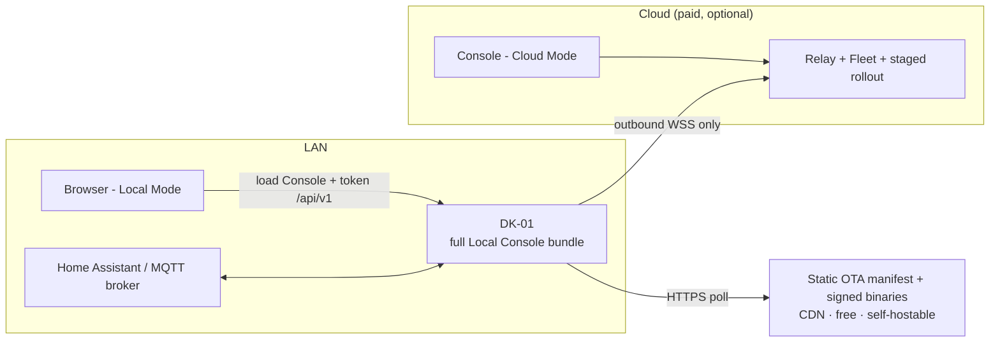

# The Console — portal spec

The Console is one web app where an owner claims, controls, extends,
and — if they want — leaves. Every screen answers
three questions: *what is my box doing, can I change it, can I trust it?*

## Principles

1. **Local-first.** The same Console works in Local Mode (LAN, no
   account, free) and Cloud Mode (paid: remote, multi-site fleet,
   hosted snapshots). Cloud adds reach, never capability — the full
   split, pricing, and sunset covenant live in docs/MODES.md.
   (ADR-0003, ADR-0007)
   The complete Local Console is bundled with and served by each
   device. A public static copy may also provide docs, demos, and a
   convenient entry point, but it is never required to operate a box.
2. **Show, don't claim.** Live Mirror instead of a status dot. Audit log
   instead of "secure by design" copy. Rollback history instead of
   "reliable".
3. **Tenancy is absolute.** An account sees exactly its own devices.
   No global views, no shared anything, no "community presence" leaks.
4. **Every capability has an API.** Anything a button does, a documented
   `/api/v1` call or MQTT topic does too.

## Information architecture

| Nav item | Job to be done | Key modules |
|---|---|---|
| **Welcome / Claim** (first run) | From box to claimed in minutes | enter the panel's local address + claim code, verify the session code on-panel, possession proof, LAN token mint, prove first pixel over LAN, then make the explicit Local-free choice; optional passkey account and separately confirmed Cloud subscription (☁) |
| **Dashboard** | What is my box doing right now? | Mirror (live panel), 64×32 paint canvas (frame push / live strokes), quick text push, brightness, scene switch, stat tiles (uptime, heap, RSSI, temp), recent activity, firmware card, quick actions (screenshot, identify, reboot, quiet hours) |
| **Devices** | Manage my fleet (only mine) | Device cards, groups, claim-new flow, rename, transfer ownership, guest access (scoped links ☁), remove |
| **Apps** | Run my code on my box | Installed apps with status + permission chips + resource meters, upload (.dmapp drag-drop → OTA), template link, community Registry browse/install, per-app logs, rollback, delete |
| **Deploy** | Control what firmware runs | Current version + channel selector, update/rollback with history, staged rollout across fleet, USB flash from browser (WebSerial recovery), BYO builds (CI → signed with owner's enrolled key) |
| **Dev console** | Integrate and debug | Device workbench (four minimal movable/resizable/removable/restorable panes profiled as REST, MQTT, logs, or a layout/binding inspector — an app REPL returns only if scripted apps ship, ADR-0026), API keys (scoped, revocable), API playground, WebSocket event tail, metrics history, device file manager |
| **Security** | Trust, verify, own | LAN token rotation, Change Wi-Fi, factory reset (physical-access class), Passkeys & hardware keys, active sessions, audit log (export), root-of-trust status + enrollment, Local Mode toggle, Snapshots (E2EE backup/restore/clone), privacy & data controls, Eject |
| **Settings** | Make it mine | Device name/timezone, network info, MQTT credentials + topic tree (user's broker), panel calibration, notifications (offline alerts ☁), plan & billing (Cloud), account |
| **Guide** | Learn it without leaving it | In-console owner's guide: five-minute setup path, page-by-page reference, the Local/Cloud split, first-line troubleshooting — served by the device, works offline |

Console-wide search is a combined search and command palette, available
from every post-claim screen and from the keyboard (`Cmd/Ctrl+K`). It
covers pages, settings, devices, installed apps, API keys, actions,
documentation, and local log results, then navigates to the matched
surface or runs the matched action. This is still the owner's
already-loaded Console state plus that device's local logs — never a
server-side or cross-tenant search service.

The Device workbench is intentionally smaller than a browser IDE. Its
job is fast integration and debugging against one selected box: run a
documented REST or MQTT command, inspect logs, or trace a layout's
bindings without hiding the underlying contracts. Panes are movable,
resizable, removable, and restorable, and the pane layout is saved
locally in that browser. Terminals are custom DOM components
(ADR-0014); the Console never exposes a general host shell, and the
prototype never executes arbitrary code.

That workbench constraint is now decided (ADR-0028): a browser cannot
speak raw MQTT TCP, so the MQTT pane requires the owner's broker to
expose a WebSocket listener, documented in the pane UI and the setup
docs. The device is not made a broker proxy for the Console.

Console typography is the system UI stack at normal 400 weight, with
the native monospace stack for terminals; the Console never downloads
a font at runtime (ADR-0014).

## Five-minute first pixel

The Local path is the primary onboarding path and must fit on one
checklist:

1. Power the DK-01 and join WiFi over USB Improv or its setup SoftAP.
2. Read the local address and claim code shown on the panel.
3. Enter both in the Console; verify the short “CLAIM → 7F2Q?” session
   code on the panel and hold the physical button.
4. Name the device and push text with the tokenized curl command. See
   the first pixel change over the LAN; no account, checkout, or
   Devmatrix server is involved.
5. Continue in free Local Mode. Only after first-pixel success may the
   Console explain optional paid Cloud or owner-hosted remote access.

## The full-control inventory

Ways an owner has *actual* control, beyond the obvious. Each maps to a
tier from VISION.md and must survive into the real build.
(☁ = Cloud Mode, the paid layer — docs/MODES.md is the line.)

- **Push anything**: text, full frames, JSON layouts, notification
  overlays — from curl, HA, Node-RED, SDKs, or the Console. Frames
  ride REST/WebSocket only, never MQTT (ADR-0029).
- **Run anything**: install declarative apps with explicit, visible
  permissions (net hosts, storage quota, refresh rate), kill-switch and
  resource meters per app; run host apps on a machine you already own
  for anything heavier (ADR-0026).
- **Flash anything**: OTA channels, or browser USB flash of *any*
  firmware — including their own fork.
- **Own the root of trust**: enroll their own signing key (physical
  ceremony); their CI ships to their boxes.
- **Leave**: Eject wizard sets a self-hosted OTA manifest URL, exports
  Snapshots, links the self-host guide. No dark patterns.
- **See everything**: audit log of every action (human or automatic),
  exportable; live logs; metrics history; screenshot of the framebuffer.
- **Share safely**: locally, sharing is the LAN token — all-or-nothing,
  by design. Cloud ☁ adds guest access with narrow scopes and expiry.
  Ownership transfer with a clean handover (old owner's data purged).
- **Go dark**: Local Mode — cloud relay off, LAN-only; telemetry is
  opt-in and off by default; export-all and delete-all are one click.
- **Recover always**: Snapshots restore/clone; USB recovery flash works
  on a dead device; factory reset requires physical access.
- **Lose it safely ☁**: mark a device lost — relay access dies
  instantly, secrets wipe on next contact, LAN token / WiFi / MQTT
  credentials rotate in one click. Local-only, the recovery tool is
  physical access.
- **Fleet as config**: export a device's setup as a named config and
  apply it to a group — declarative, diffable, audit-logged.

## Architecture (modes)

- Device never opens an inbound WAN port. Its LAN-only API serves Local
  Mode; Cloud Mode rides the device's outbound relay connection.
- Discovery is read-off-the-panel (address + claim code); the Console
  never scans a LAN. LAN auth is the LAN token; mTLS is device→relay
  only. See SECURITY.md → Discovery & local transport.
- The device serves the complete static Local Console, including setup,
  control, apps, deploy, developer tools, security, and Eject. The
  hosted Console is an optional distribution of the same client, not a
  dependency.
- The production stack is decided and built: Preact + TypeScript + Vite
  at `portal/console/`, one codebase emitting the device's generated
  gzipped header and the hosted static bundle (ADR-0014, ADR-0027).
  The hosted copy opens with a welcome flow: connect a real panel over
  the LAN (ADR-0031 path 2 — Local Network Access on Chromium/Firefox,
  with the device-served path as the documented fallback), or enter a
  clearly-labeled mock demo. Connecting verifies the device's signed
  nonce and pins its Ed25519 identity key in that browser; firmware
  enforces the exact-origin CORS allowlist and Host allowlist that
  make the cross-origin path safe. Four named ADR-0031 browser
  experiments (ws:// LNA exemption, `.local` HTTPS-Upgrades, Firefox
  151→153 parity, macOS local-network permission) remain open P1
  hardware-evidence items.
- API contract: DRAFT contracts live in
  [contracts/](../contracts/README.md), including the per-transport
  capability descriptors; they freeze at gate P2 (ADR-0019).

## Non-goals

No social features, no public device pages, no ads, no telemetry by
default, no company-run MQTT broker, no accounts required for LAN use.

## Open questions

- ~~Exact browser-to-device HTTPS trust/bootstrap design.~~ Closed by
  the P1 spike: the device's local transport is plain HTTP, permanently,
  with the hosted Console reaching it through the browser's Local
  Network Access permission where available (ADR-0031;
  [evidence](../hardware/evidence/2026-08-12-browser-transport-spike.md)).
- ~~Domain/brand for the hosted Console.~~ Decided: the hosted Console
  is served from `devmatrix.flighttrackerled.com` (ADR-0025).
- Enclosure question (bare panel vs stand) — affects photography, not
  software.
